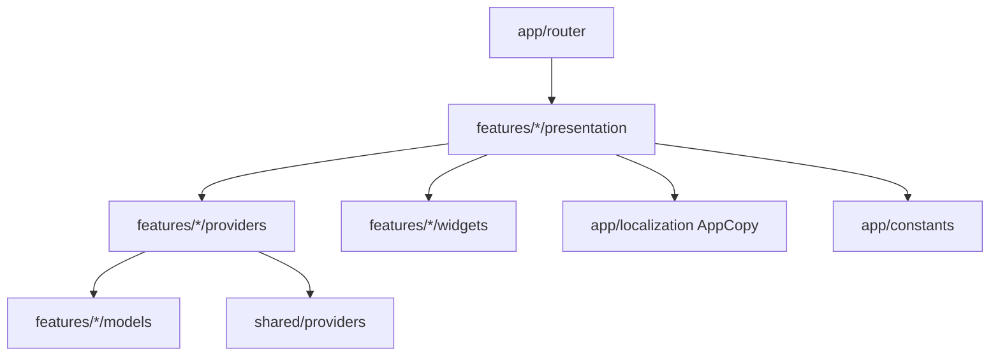

# Visión General de Arquitectura — tinytalk

Aplicación **Flutter**, gestión de estado con **Riverpod** (`Notifier`/`AsyncNotifier` + `Provider`), navegación con **go_router**. Organización **feature-first** bajo `tinytalk/lib/`:

```
tinytalk/lib/
├── app/
│   ├── constants/        # catálogos estáticos (ej. mini_game_data.dart)
│   ├── localization/     # AppCopy: strings ES/EN
│   └── router/           # app_router.dart, app_routes.dart
├── core/                 # widgets compartidos (AppImage, PlayfulBackground, ...)
├── features/
│   └── <feature>/
│       ├── models/           # estado de dominio inmutable del feature
│       ├── providers/        # Riverpod Notifier/AsyncNotifier + provider
│       ├── widgets/          # widgets compartidos ENTRE pantallas del mismo feature
│       └── presentation/
│           └── <pantalla>/
│               ├── <pantalla>_screen.dart
│               └── widgets/  # CustomPainter, overlays, componentes locales de esa pantalla
└── shared/               # providers/modelos cruzados entre features (words, language, services)
```

## Patrón por feature

1. **Models**: clases inmutables (`copyWith`) que representan el estado del dominio del feature (ej. `TracePathShape`, `DrawStroke`, `ColoringPage`).
2. **Providers**: un `State` inmutable + `Notifier`/`AsyncNotifier` que expone acciones mutadoras; se registra como `NotifierProvider`/`AsyncNotifierProvider` global. Una pantalla puede tomar una instancia **aislada** de un provider global vía `ProviderScope(overrides: [...])` cuando necesita estado fresco por instancia (ej. `ColoringCanvasScreen` con `freeDrawProvider`).
3. **Presentation**: `ConsumerWidget`/`ConsumerStatefulWidget` que hace `ref.watch`/`ref.read` del provider del feature; efectos visuales (partículas, curvas, trazos) se aíslan en `CustomPainter` dentro de `<pantalla>/widgets/`. Widgets reutilizados por **más de una pantalla** del mismo feature suben a `features/<feature>/widgets/` (ej. `DrawingPalette` compartido entre `free_draw` y `coloring_book`).
4. **Routing**: cada pantalla nueva se registra en `app/router/app_router.dart`; para minijuegos, el `switch` sobre `gameId` mapea el `id` del catálogo (`app/constants/mini_game_data.dart`) a su `Screen`. Un minijuego puede además declarar rutas propias con parámetros adicionales (ej. `AppRoutes.coloringPage` = `/coloring/:pageId`, fuera del `switch`, para navegar de una galería a un detalle).
5. **Localización**: strings ES/EN centralizados en `AppCopy` (`app/localization/app_language.dart`), expuesto vía `appCopyProvider`.

## Diagrama de capas



## Módulos documentados

- [[Mini Juegos]] — catálogo y detalle de cada minijuego, incluye `trace_path`, `free_draw` y `coloring_book`.

## Relacionado

- [[Mini Juegos]]
