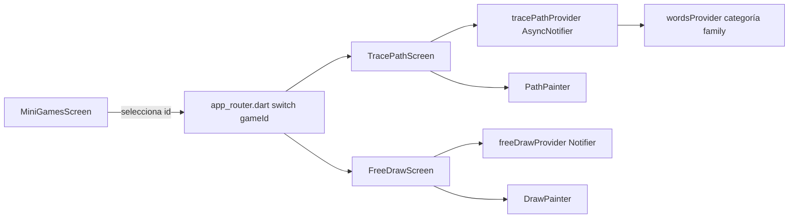

# Mini Juegos (tinytalk)

Módulo feature-first en `tinytalk/lib/features/mini_games/`. Cada minijuego sigue el mismo patrón: `models/` (estado inmutable de dominio del juego), `providers/` (Riverpod `Notifier`/`AsyncNotifier`), `presentation/<juego>/` (pantalla + `widgets/` con `CustomPainter` u otros widgets propios).

Catálogo definido en `tinytalk/lib/app/constants/mini_game_data.dart` (`MiniGameData`: id, títulos ES/EN, emoji, gradiente, descripción ES/EN) y enrutado en `tinytalk/lib/app/router/app_router.dart` vía `switch` sobre `gameId` en la ruta `AppRoutes.miniGame`.

## Catálogo de minijuegos

| id | Pantalla | Título ES | Descripción |
|----|----------|-----------|-------------|
| `pop_bubbles` | `PopBubblesScreen` | Revienta Burbujas | Toca las burbujas |
| `drag_drop` | `DragDropScreen` | Arrastra y Ordena | Arrastra al lugar correcto |
| `animal_finder` | `AnimalFinderScreen` | ¿Dónde está el animal? | Encuentra el animal correcto |
| `feed_animal` | `FeedAnimalScreen` | Alimenta al Animal | Dale la comida al animal |
| `touch_color` | `TouchColorScreen` | Toca el Color | Toca el color correcto |
| `follow_star` | `FollowStarScreen` | Sigue la Estrella | Sigue la estrella mágica |
| `dress_up` | `DressUpScreen` | Viste a Coco | Pon accesorios a Coco |
| `trace_path` | `TracePathScreen` | Sigue el Camino | Sigue el camino con tu dedo — **nuevo** |
| `free_draw` | `FreeDrawScreen` | Dibuja Libre | Dibuja lo que quieras — **nuevo** |

## Sigue el Camino (`trace_path`)

Traza con el dedo una curva normalizada (0–1) entre la palabra "bebé" (`family_baby`) y otro miembro de la familia, con feedback de progreso, sparkles y celebración al completar.

**Modelo** — `models/trace_path.dart`
- `TracePathShape`: lista de `waypoints` (Offset normalizados). `positionAt(t)` interpola con smooth-step entre segmentos. `all`: 4 curvas predefinidas (arco, zigzag, diagonal, S).
- `TracePathRound`: par `start`/`end` (`LearningWord`) + `TracePathShape` de la ronda.

**Provider** — `providers/trace_path_provider.dart`
- `TracePathState`: `rounds`, `currentIndex`, `roundsCompleted`, `showCelebration`.
- `TracePathNotifier extends AsyncNotifier<TracePathState>`: en `build()` toma `wordsProvider` filtrado a categoría `family`, fija `family_baby` como inicio y genera una ronda por cada otro familiar, asignando curvas de `TracePathShape.all` de forma cíclica.
- `onPathCompleted()`: elige siguiente índice aleatorio distinto al actual (si hay más de una ronda), incrementa `roundsCompleted`, activa `showCelebration`.
- `dismissCelebration()`, `restart()` (invalida el provider).

**Pantalla** — `presentation/trace_path/trace_path_screen.dart`
- Detección de trazado: `_handleDrag` muestrea la curva en `_sampleSteps = 120` pasos, valida cercanía táctil por `_hitRadius = 90.0`, avanza `_progress` solo hacia adelante; completa la ronda al superar `_completionThreshold = 0.98`.
- Emite `SparkleOverlay` en cada avance y al completar; reproduce audio de la palabra destino (`audioServiceProvider.playAsset`) con fallback a TTS (`ttsServiceProvider.speakWord`).
- `PathPainter` (`widgets/path_painter.dart`): dibuja guía punteada blanca y relleno dorado de progreso sobre la curva.
- Copy: `AppCopy.followThePathTo(String name)` (ES/EN) en `app/localization/app_language.dart`.

> ⚠️ Nota técnica: `_handleDrag` deja dos `debugPrint` activos (touch/screen/progress y `bestT`) en cada `onPanUpdate` — pendiente de limpieza antes de release.

## Dibuja Libre (`free_draw`)

Canvas libre: el niño dibuja con el dedo eligiendo color, tipo de pincel y tamaño de trazo.

**Modelo** — `models/free_draw.dart`
- `BrushType`: `pencil`, `brush`, `watercolor`, `marker`.
- `BrushSize`: `small`, `medium`, `large`.
- `BrushWidth` (extension sobre `BrushType`): `widthFor(BrushSize)` resuelve el ancho de trazo por combinación pincel/tamaño.
- `DrawStroke`: `color`, `points` (lista de `Offset`), `brushType`, `width`; `withPoint(Offset)` retorna copia extendida (inmutable).
- `FreeDrawPalette`: paleta fija de 8 colores, alineada a la de `touch_color`.

**Provider** — `providers/free_draw_provider.dart`
- `FreeDrawState`: `strokes`, `selectedColor`, `selectedBrush`, `selectedSize`, `isPanelOpen`.
- `FreeDrawNotifier extends Notifier<FreeDrawState>`: `selectColor`, `selectBrush`, `selectSize`, `startStroke(Offset)`, `extendStroke(Offset)` (agrega punto al último trazo), `clear()`, `togglePanel()`.

**Pantalla** — `presentation/free_draw/free_draw_screen.dart`
- Canvas full-screen vía `GestureDetector` (`onPanStart`/`onPanUpdate`) + `DrawPainter` (`widgets/draw_painter.dart`) como `foregroundPainter`.
- `DrawPainter._paintFor`: estilo de trazo por `BrushType` — `pencil`/`marker` sólidos con cap distinto; `brush`/`watercolor` con `MaskFilter.blur` y opacidad reducida (0.92 / 0.35).
- Panel de paleta colapsable (`isPanelOpen`), adaptado a orientación (abajo en portrait, lateral en landscape): selector de color, pincel y tamaño.
- Copy: `AppCopy.freeDrawHint` (ES/EN).

## Diagrama de flujo (nuevo minijuego)

## Relacionado

- [[Visión General]]
- [[Módulo Mini Juegos]]
