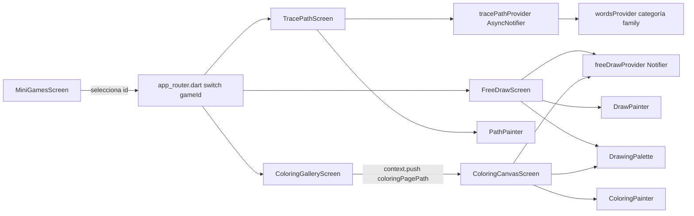

# Mini Juegos (tinytalk)

Módulo feature-first en `tinytalk/lib/features/mini_games/`. Cada minijuego sigue el mismo patrón: `models/` (estado inmutable de dominio del juego), `providers/` (Riverpod `Notifier`/`AsyncNotifier`), `presentation/<juego>/` (pantalla + `widgets/` con `CustomPainter` u otros widgets propios). Widgets reutilizados **entre** minijuegos (no exclusivos de uno) viven en `features/mini_games/widgets/` (ej. `drawing_palette.dart`).

Catálogo definido en `tinytalk/lib/app/constants/mini_game_data.dart` (`MiniGameData`: id, títulos ES/EN, emoji, gradiente, descripción ES/EN) y enrutado en `tinytalk/lib/app/router/app_router.dart` vía `switch` sobre `gameId` en la ruta `AppRoutes.miniGame`.

## Catálogo de minijuegos

| id | Pantalla | Título ES | Descripción |
|----|----------|-----------|-------------|
| `pop_bubbles` | `PopBubblesScreen` | Revienta Burbujas | Toca las burbujas |
| `drag_drop` | `DragDropScreen` | Arrastra y Ordena | Arrastra al lugar correcto |
| `animal_finder` | `AnimalFinderScreen` | ¿Dónde está el animal? | Encuentra el animal correcto |
| `feed_animal` | `FeedAnimalScreen` | Alimenta al Animal | Dale la comida al animal |
| `touch_color` | `TouchColorScreen` | Toca el Color | Toca el color correcto |
| `follow_star` | `FollowStarScreen` | Sigue la Estrella | Sigue la estrella mágica |
| `dress_up` | `DressUpScreen` | Viste a Coco | Pon accesorios a Coco |
| `trace_path` | `TracePathScreen` | Sigue el Camino | Sigue el camino con tu dedo |
| `free_draw` | `FreeDrawScreen` | Dibuja Libre | Dibuja lo que quieras |
| `coloring_book` | `ColoringGalleryScreen` → `ColoringCanvasScreen` | Colorea | Pinta los dibujos |

## Sigue el Camino (`trace_path`)

Traza con el dedo una curva normalizada (0–1) entre la palabra "bebé" (`family_baby`) y otro miembro de la familia, con feedback de progreso, sparkles y celebración al completar.

**Modelo** — `models/trace_path.dart`
- `TracePathShape`: lista de `waypoints` (Offset normalizados). `positionAt(t)` interpola con smooth-step entre segmentos. `all`: 4 curvas predefinidas (arco, zigzag, diagonal, S).
- `TracePathRound`: par `start`/`end` (`LearningWord`) + `TracePathShape` de la ronda.

**Provider** — `providers/trace_path_provider.dart`
- `TracePathState`: `rounds`, `currentIndex`, `roundsCompleted`, `showCelebration`.
- `TracePathNotifier extends AsyncNotifier<TracePathState>`: en `build()` toma `wordsProvider` filtrado a categoría `family`, fija `family_baby` como inicio y genera una ronda por cada otro familiar, asignando curvas de `TracePathShape.all` de forma cíclica.
- `onPathCompleted()`: elige siguiente índice aleatorio distinto al actual (si hay más de una ronda), incrementa `roundsCompleted`, activa `showCelebration`.
- `dismissCelebration()`, `restart()` (invalida el provider).

**Pantalla** — `presentation/trace_path/trace_path_screen.dart`
- Detección de trazado: `_handleDrag` muestrea la curva en `_sampleSteps = 120` pasos, valida cercanía táctil por `_hitRadius = 90.0`, avanza `_progress` solo hacia adelante; completa la ronda al superar `_completionThreshold = 0.98`. Ya sin `debugPrint` de depuración (removidos).
- La imagen de inicio (`_startImageFor`) ahora se posiciona con `round.shape.positionAt(_progress)` (`babyPos`) en vez de quedarse fija en `round.shape.start` — el bebé se mueve visualmente a lo largo del camino a medida que el niño avanza el trazo. Se eliminó el widget `_ProgressMarker` (el punto dorado brillante independiente); la imagen del bebé cumple ahora ese rol de indicador de progreso.
- El `CustomPaint` decorativo de `PathPainter` está envuelto en `IgnorePointer` (bug conocido de Flutter: un `CustomPaint` con `size` explícito absorbe los touches de su área aunque no tenga `child` ni override de `hitTest`, bloqueando al `GestureDetector` debajo en el `Stack` — ver nota de arquitectura). El `_PromptBubble` (mensaje "sigue el camino hacia...") también se envolvió en `IgnorePointer` por el mismo motivo.
- Emite `SparkleOverlay` en cada avance y al completar; reproduce audio de la palabra destino (`audioServiceProvider.playAsset`) con fallback a TTS (`ttsServiceProvider.speakWord`).
- `PathPainter` (`widgets/path_painter.dart`): dibuja la guía punteada (ahora azul `0xFF3642C7` con contorno blanco, antes blanco semitransparente) y el relleno dorado de progreso (con contorno blanco añadido) sobre la curva, para mejorar el contraste visual de ambos estados de los puntos.
- Copy: `AppCopy.followThePathTo(String name)` (ES/EN) en `app/localization/app_language.dart`.

> Nota de arquitectura (Flutter): cualquier `CustomPaint` puramente decorativo colocado sobre un `GestureDetector` interactivo dentro de un `Stack` debe envolverse en `IgnorePointer` — de lo contrario absorbe los touches y el gesto nunca llega al detector. Aplica también a `follow_star_screen.dart` (`StarTrailPainter`), pendiente de revisión.

## Dibuja Libre (`free_draw`)

Canvas libre: el niño dibuja con el dedo eligiendo color, tipo de pincel y tamaño de trazo.

**Modelo** — `models/free_draw.dart`
- `BrushType`: `pencil`, `brush`, `watercolor`, `marker`.
- `BrushSize`: `small`, `medium`, `large`.
- `BrushWidth` (extension sobre `BrushType`): `widthFor(BrushSize)` resuelve el ancho de trazo por combinación pincel/tamaño.
- `DrawStroke`: `color`, `points` (lista de `Offset`), `brushType`, `width`; `withPoint(Offset)` retorna copia extendida (inmutable).
- `StrokePaint` (extension sobre `DrawStroke`): `toPaint()` — resuelve el `Paint` de renderizado por `brushType` (antes vivía como método privado `_paintFor` dentro de `DrawPainter`; ahora es reutilizable desde cualquier painter, incluido `ColoringPainter`).
- `FreeDrawPalette`: paleta fija de 8 colores, alineada a la de `touch_color`.

**Provider** — `providers/free_draw_provider.dart`
- `FreeDrawState`: `strokes`, `selectedColor`, `selectedBrush`, `selectedSize`, `isPanelOpen`.
- `FreeDrawNotifier extends Notifier<FreeDrawState>`: `selectColor`, `selectBrush`, `selectSize`, `startStroke(Offset)`, `extendStroke(Offset)` (agrega punto al último trazo), `clear()`, `togglePanel()`.
- Reutilizado también por `coloring_book`: `ColoringCanvasScreen` hace `ProviderScope(overrides: [freeDrawProvider], ...)` para obtener una instancia de estado fresca por página de coloreado (evita arrastrar trazos entre páginas o con la pantalla `free_draw`).

**Pantalla** — `presentation/free_draw/free_draw_screen.dart`
- Canvas full-screen vía `GestureDetector` (`onPanStart`/`onPanUpdate`) + `DrawPainter` (`widgets/draw_painter.dart`) como `foregroundPainter`; `DrawPainter` ahora delega el estilo de trazo a `stroke.toPaint()`.
- Panel de paleta colapsable (`isPanelOpen`), adaptado a orientación (abajo en portrait, lateral en landscape): selector de color, pincel y tamaño — **extraído** a `DrawingPalette` (`features/mini_games/widgets/drawing_palette.dart`), junto con `GlassButton` y `PanelReopenButton`, para compartirlo con `coloring_book`.
- Copy: `AppCopy.freeDrawHint` (ES/EN).

## Colorea (`coloring_book`)

Libro de colorear: el niño elige un dibujo de línea (blanco y negro) en una galería y lo pinta encima con el mismo lienzo/paleta de `free_draw`.

**Modelo** — `models/coloring_page.dart`
- `ColoringPage`: `id`, `titleEs`, `titleEn`, `assetPath`.
- Catálogo estático `coloringPages`, ampliado a 15 dibujos organizados por franquicia:
  - Frozen: `olaf`, `frozen_elsa`, `frozen_elsa_2`.
  - Toy Story: `toy_story_alien`, `bo_peep`, `rex`, `forky`, `buzz_pointing`, `buzz_running`, `potato_heads`.
  - Moana: `moana_baby`, `moana_portrait`, `moana_beach`, `moana_with_pua`, `maui`.

**Pantallas** — `presentation/coloring_book/`
- `coloring_gallery_screen.dart` (`ColoringGalleryScreen`, `ConsumerWidget`): grilla (`SliverGrid.builder`, `maxCrossAxisExtent: 180`) de tarjetas por `ColoringPage`, título según `AppLanguage` activo; tap navega a `AppRoutes.coloringPagePath(page.id)`.
- `coloring_canvas_screen.dart` (`ColoringCanvasScreen`, recibe `pageId`): carga el asset de línea vía `rootBundle.load` + `ui.instantiateImageCodec` a un `ui.Image`; mientras carga muestra `CircularProgressIndicator`. Reutiliza `freeDrawProvider` (con `ProviderScope` override, ver arriba) y `DrawingPalette` para el mismo flujo de dibujo que `free_draw`.
- `widgets/coloring_painter.dart` (`ColoringPainter`): pinta fondo blanco, luego los trazos del niño (`stroke.toPaint()`), y finalmente la línea de arte (`lineArt`) con `BlendMode.multiply` — el blanco del dibujo se vuelve transparente (deja ver el color pintado debajo) y el negro de las líneas se mantiene siempre visible encima.

**Routing** — dos niveles:
1. `AppRoutes.miniGame` (`/mini-games/:gameId`) con `gameId == 'coloring_book'` → `ColoringGalleryScreen` (mismo `switch` que el resto de minijuegos).
2. Ruta dedicada `AppRoutes.coloringPage` (`/coloring/:pageId`) → `ColoringCanvasScreen(pageId: ...)`, navegada por `context.push(AppRoutes.coloringPagePath(pageId))` desde la galería.

Copy: `AppCopy.chooseADrawing` (ES/EN) en `app/localization/app_language.dart`.

Assets: carpeta `assets/images/coloring/` declarada en `pubspec.yaml`, formatos mixtos (`.webp`, `.jpg`, `.png`) según el dibujo.

## Diagrama de flujo (minijuegos de dibujo)

## Relacionado

- [[Visión General]]
- [[Módulo Mini Juegos]]
